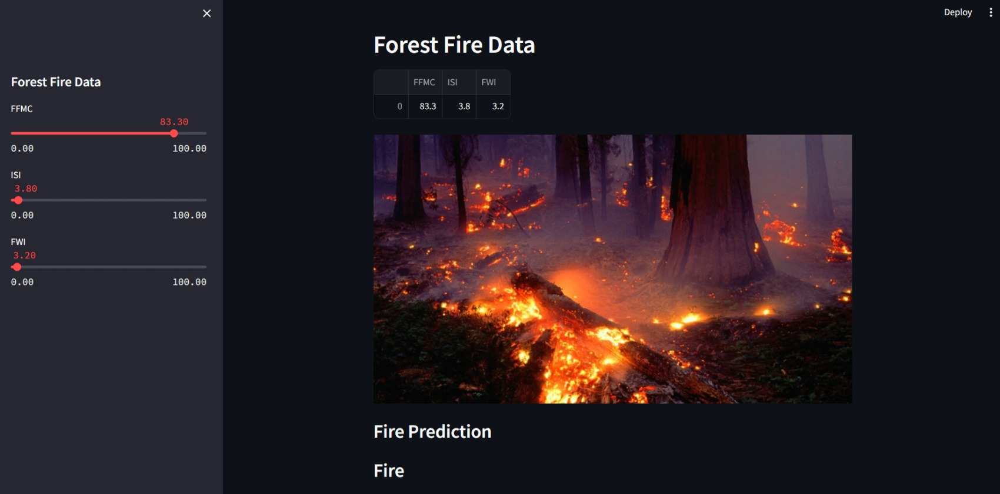

# Forest-Fire-Prediction-Using-Streamlit

### This website, gives the predfiction whether the Forest is fire or not fire, depending on the features like Fine Fuel Moisture Code (FFMC),Initial Spread Index (ISI),Initial Spread Index (ISI), Used the basic Logistic Regression to train the model, Later used the streamlit library, which is the Cloud Platform as a Service.

WebApp hosted at- https://forest-fire-prediction-using-app-ixznfxbfqny5xgttdearct.streamlit.app/
